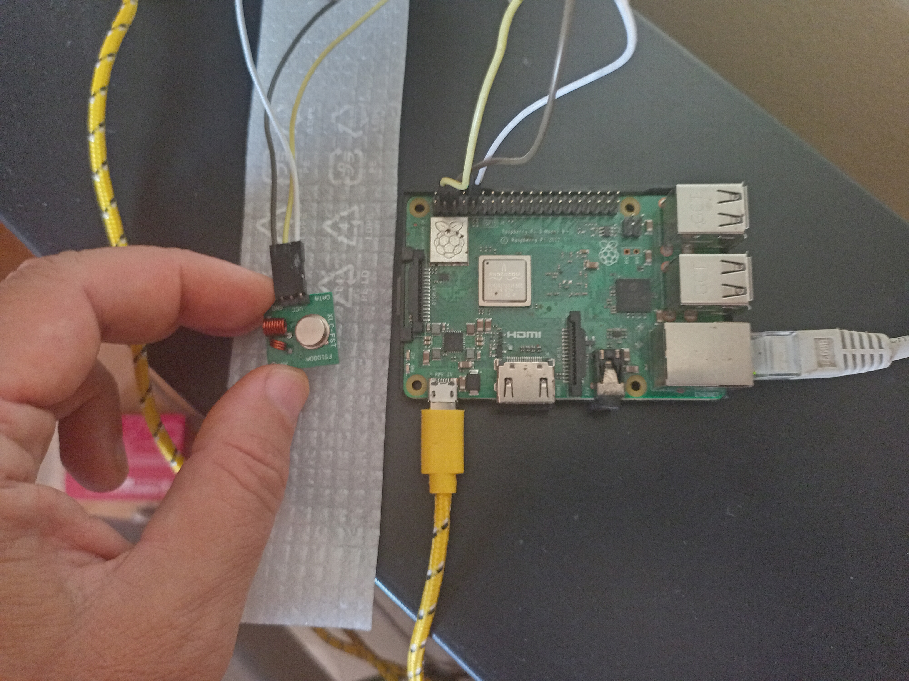

# SmartCharger Server 

This is simple TCP/IP server application featuring running on a raspberry unit installed in a local network.
It receives status from the Phone with a SmartCharger.Android application and switch smart outlet ON or OFF, depending of the battery level and defined parameters.
Language is Python, version 3.

In this project I was using the FS1000A transmitter and corresponding receiver, but it should also work with other 433MHz transmitter/receiver modules that work in a similar fashion. These RF modules are very popular among the Arduino tinkerers and are used on a wide variety of applications that require wireless control.

Introduction
------------

Python module for sending and receiving 433/315MHz LPD/SRD signals with generic low-cost GPIO RF modules on a Raspberry Pi.

Protocol and base logic ported ported from `rc-switch`_.

Supported hardware
------------------

Most generic 433/315MHz capable modules (cost: ~2€) connected via GPIO to a Raspberry Pi.

.. figure:: http://i.imgur.com/vG89UP9.jpg
   :alt: 433modules

Compatibility
-------------

Generic RF outlets and most 433/315MHz switches (cost: ~15€/3pcs).

.. figure:: http://i.imgur.com/WVRxvWe.jpg
   :alt: rfoutlet

Chipsets:

* SC5262 / SC5272
* HX2262 / HX2272
* PT2262 / PT2272
* EV1527 / RT1527 / FP1527 / HS1527

For a full list of compatible devices and chipsets see the `rc-switch Wiki`_

Dependencies
------------

::

    RPi.GPIO

Installation
------------

On your Raspberry Pi, install the *rpi_rf* module via pip.

Python 3::

    # apt-get install python3-pip
    # pip3 install rpi-rf

Wiring diagram (example)
------------------------

Raspberry Pi 1/2(B+)::

                       RPI GPIO HEADER
                 
                          _______
                         |       |
                       01|  . .  |02
                  _______|__._x  |
                 |   ____|__._x  |
                 |  |    |  . .  |
       TX        |  |  __|__._x  | 
     _______     |  | |  |  . .  | 
    |       |    |  | |  |  . .  |
    |    GND|____|__| |  |  . .  | 
    |       |    |    |  |  . .  | 
    |    VCC|____|    |  |  . .  | 
    |       |         |  |  . .  | 
    |   DATA|_________|  |  . .  | 
    |_______|            |  . .  |
                         |  . .  |
                         |  . .  |
                         |  . .  |
                         |  . .  |
                         |  . .  |
                         |  . .  |
                       39|  . .  |40
                         |_______|

    TX:
       GND > PIN 09 (GND)
       VCC > PIN 04 (5V)
      DATA > PIN 10 (GPIO15)
   
Usage
-----

See `scripts`_ (`rpi-rf_send`_, `rpi-rf_receive`_) which are also shipped as cmdline tools.

Open Source
-----------

* The code is licensed under the `BSD Licence`_
* The project source code is hosted on `GitHub`_
* Please use `GitHub issues`_ to submit bugs and report issues

.. _rc-switch: https://github.com/sui77/rc-switch
.. _rc-switch Wiki: https://github.com/sui77/rc-switch/wiki
.. _BSD Licence: http://www.linfo.org/bsdlicense.html
.. _GitHub: https://github.com/milaq/rpi-rf
.. _GitHub issues: https://github.com/milaq/rpi-rf/issues
.. _scripts: https://github.com/milaq/rpi-rf/blob/master/scripts
.. _rpi-rf_send: https://github.com/milaq/rpi-rf/blob/master/scripts/rpi-rf_send
.. _rpi-rf_receive: https://github.com/milaq/rpi-rf/blob/master/scripts/rpi-rf_receive

