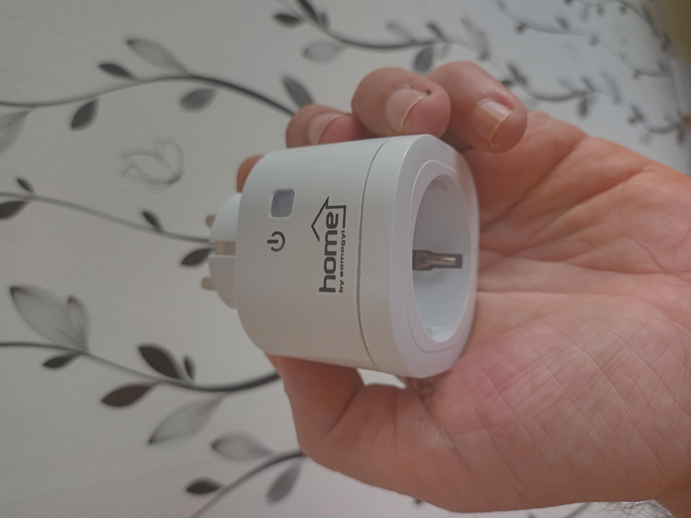
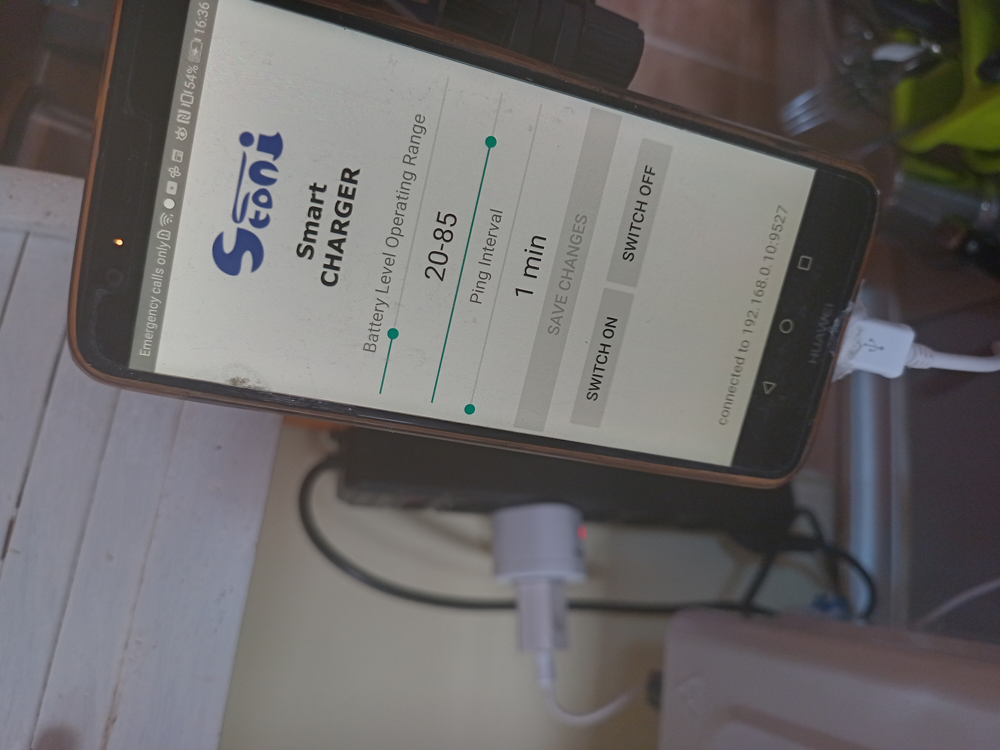

# SmartCharger Server Application

This is simple TCP/IP server application featuring running on a raspberry unit in a local network.
It receives status from the Phone with a SmartCharger.Android application and switch smart outlet ON or OFF, depending of the battery level and defined parameters.

